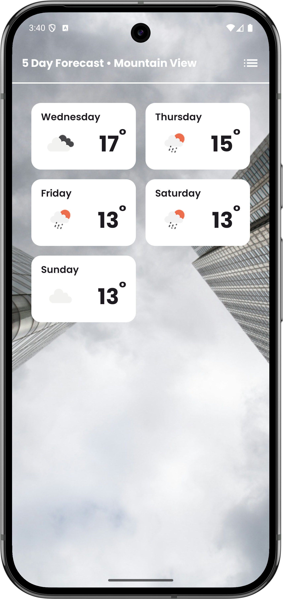
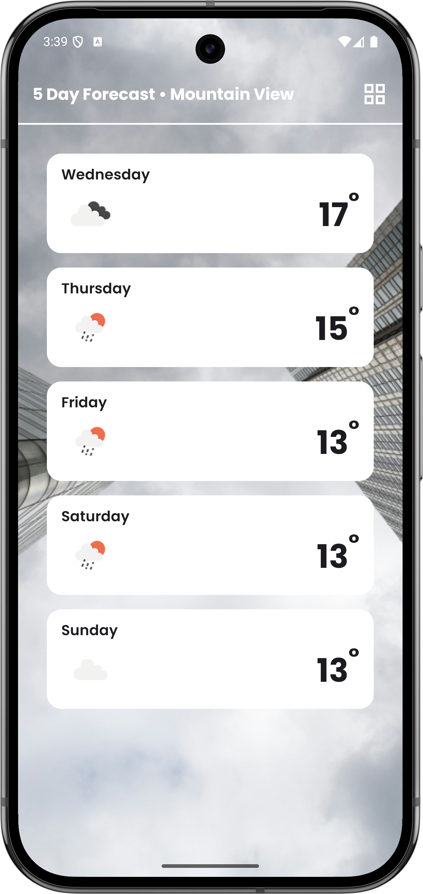
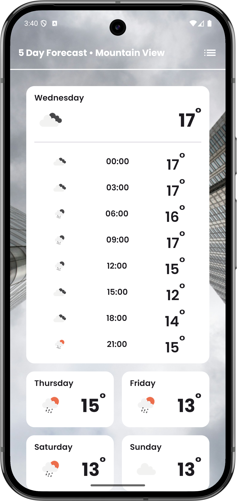
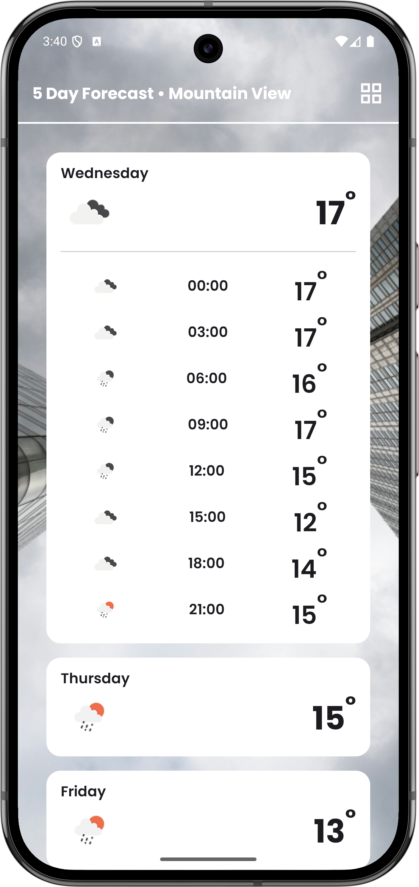
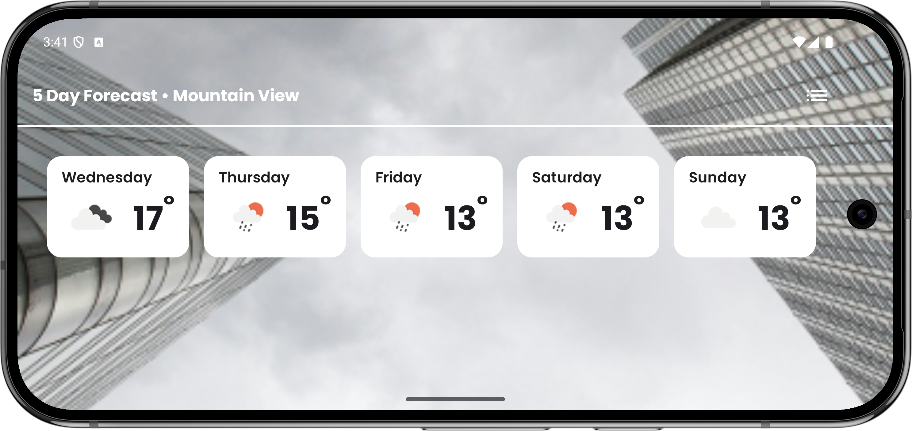
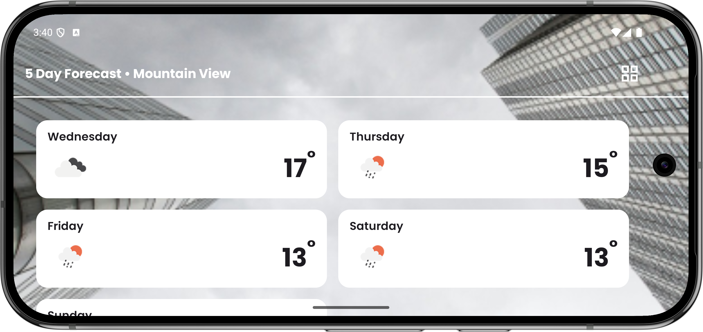

[](https://github.com/moinkhan-tech-in/AtomicWeather/actions/workflows/quality.yml)

# 🌦️ AtomicWeather

A modern Android weather application built with **Jetpack Compose** and **Clean Architecture**. Fetches 5-day weather forecasts using location-based services and the OpenWeather API.


## ✨ Features

- 📍 Location-based weather forecast
- 📅 5-day forecast with 3-hour intervals
- 🎨 Dynamic backgrounds based on weather conditions
- 📱 Grid/List view toggle
- 🔄 Error handling with retry mechanism
- 🛡️ Permission handling with rationale dialogs

## 📸 Screenshots

### Portrait Mode

<div align="center">
  
  
  
  
</div>

### Landscape Mode

<div align="center">
  
  
</div>

## 🎥 Video

<!-- Add video link or embed here when available -->
_Demo video coming soon..._

## 🏗️ Architecture

Built with **Clean Architecture** principles:

- **Domain Layer**: Pure Kotlin business logic (no Android dependencies)
- **Data Layer**: Repository implementations, DTOs, and mappers
- **Network Layer**: Retrofit with centralized error handling
- **UI Layer**: Jetpack Compose with MVVM pattern
- **Design System**: Reusable components and Material 3 theme

## 🧩 Tech Stack

- **UI**: Jetpack Compose, Material 3
- **Architecture**: Clean Architecture, MVVM
- **Async**: Kotlin Coroutines, Flow
- **DI**: Hilt
- **Networking**: Retrofit, OkHttp
- **Serialization**: kotlinx.serialization
- **Testing**: JUnit, MockK, Coroutines Test
- **Code Quality**: Detekt

## 📁 Project Structure

```
AtomicWeather/
├── app/                   # Application module
├── core/
│   ├── common/            # Shared utilities (JVM Module)
│   ├── domain/            # Business logic (JVM Module)
│   ├── data/              # Data layer
│   ├── network/           # Network configuration
│   └── designsystem/      # UI components
└── feature/
    └── weather/           # Weather feature
```

## 🚀 Getting Started

### Prerequisites

- Android Studio Hedgehog or later
- JDK 17+
- Android SDK (Min SDK: 24, Target SDK: 36)

### Setup

1. Clone the repository
   ```bash
   git clone https://github.com/moinkhan-tech-in/AtomicWeather.git
   ```

2. Get your API key from [OpenWeatherMap](https://openweathermap.org/api)

3. Add API key to `local.properties`:
   ```properties
   OPEN_WEATHER_API_KEY=your_api_key_here
   ```

4. Sync and run the project

## 🧪 Testing

```bash
# Run unit tests
./gradlew testDebugUnitTest

# Run Detekt
./gradlew detekt
```

## 🤖 CI/CD

GitHub Actions runs on every PR and push to main:
- ✅ Detekt static analysis
- ✅ Unit tests execution

## 🚧 Roadmap

- [ ] **Offline caching** - Room database for offline weather data
- [ ] **Manual location input** - City search as fallback when location unavailable

## 📱 Requirements

- Min SDK: 24
- Target SDK: 36
- Java: 17

## 📄 License

This project is for technical assessment and learning purposes.

## 👨‍💻 Author

**Moinkhan** - Android Engineer
